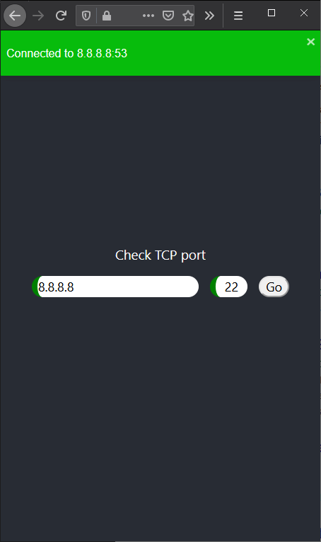
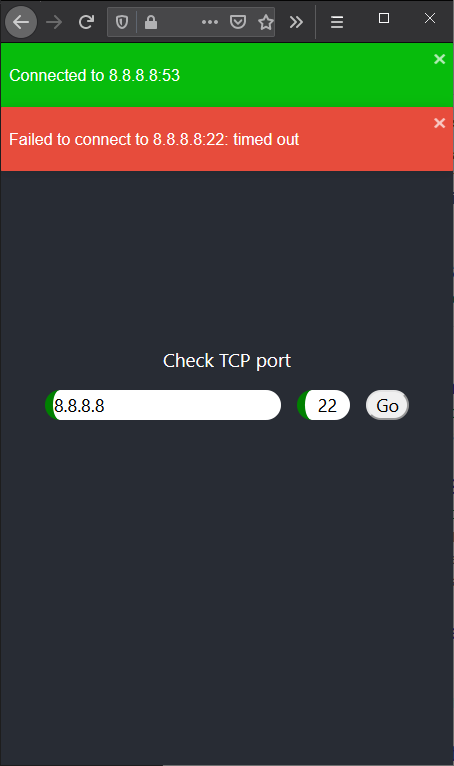

# TCP Check

## Description

A full stack web applicaton to check port from the server location written in nodejs and React. Dockerized and ready to rock on Kubernetes.
Helm chars and terraform code to stand up k8s cluster on GCP is also provided. CircleCI config is also present in the repo.

  
  

## Deployment

1. Fork repository and login to CircleCI;
2. Create a new service account with Editor access to GKE and GCE and GS;
3. Create a new storage bucket to store terraform state;
4. Export access key to json file;
5. Create the following environment variables:

* `DOCKER_PASS` - your docker hub repo password;
* `DOCKER_USER` - your docker hub repo user;
* `GOOGLE_PROJECT` - current project;
* `GOOGLE_SERVICE_ACCOUNT` - contains base64 encoded json keyfile;
* `GOOGLE_STORAGE_BUCKET` - bucket name for tf remote state

6. Trigger CircleCI build;
7. Check the logs for IP addresses for API and web applications LBs - it is required to create A records for them (api.example.com and check.example.com) on your DNS provider of choice;
8. Once the records are created and propagated to global DNS space approve the next job in CircleCI;
9. It may take a while for GCP to provision SSL certificate for LBs (~ 30min - 2h).
